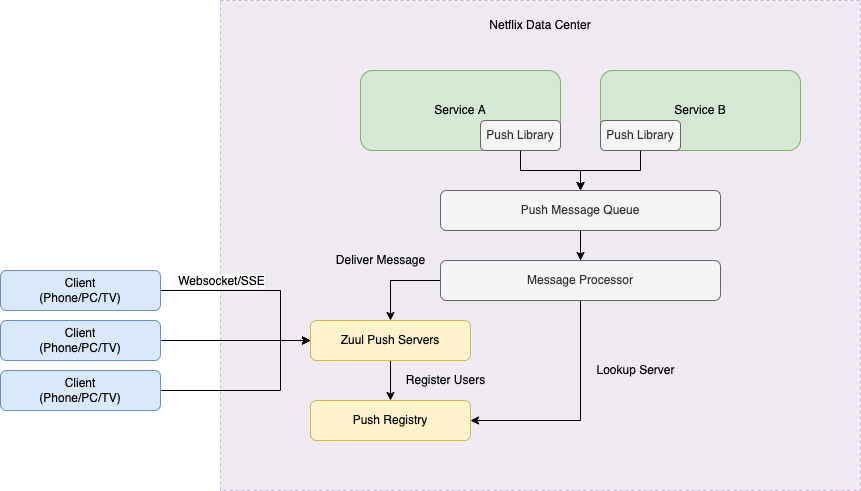

# Netflix Zuul Push

## Zuul Push Architecture

Zuul Push is the push engine at Netflix

### Workflow
1. **Client** establishes an persistent websocket/SSE connection to the **Zuul Push Service**. The **Client** will keep the connection alive until the session is terminated.
2. **Zuul Push Service** register the user and connection information to the **Push Registry** database.
3. **Service** that need to send a push message (source of push message) use the **Push Library** (SDK) to send the message to the **Push Message Queue**.
4. **Message Processor**
   1. pulls/retrieves an message from the **Push Message Queue**
   2. lookups the **Push Registry** to check which **Zuul Push Service** host is connected to the client
   3. delivers the message to the **Zuul Push Service** host
5. **Zuul Push Service** host send the message to the **Client**

## Background

Netflix use a recommendation engine to generate suggested videos for each user. i.e. the home page of the Netflix website for each user is different.

**Push vs Pull**

* Pull
  * If too frequent - Overload the system
  * If too infrequent - Data not fresh enough
* Push
  * Most suited for Netflix

**Push**

Define Push:
* **P**ersist
* **U**ntil
* **S**omething
* **H**appens

### Zuul push servers

Handling millions of persistent connections

Using Non-blocking async-io

C10K challengingL
* Supporting 10K concurrent connection on a single server

**Traditional method:**
* 1 Connection per Socket
* 1 Socket per thread

Socket --> Read --> Write --> Thread 1
Socket --> Write --> Read --> Thread 2

**Async I/O**

Socket --> write callback --> single thread --> read callback --> Socket

Netflix use **Netty** for the Async I/O

### Push Registry

Push registry feature checklist (the database used as the push registry should have the following feature):
* Low read latency
* Record expiry (e.g. TTL)
* Sharding
* Replication

TTL -> If the client failed to terminated the connection proactively; the system need to use TTL to remove the registered entry from the Push registry.

Good choice for Push Registry
* Redis
* Cassandra
* AWS DynamoDB

Netflix use **Dynomite**

Dynomite =
    + Redis
    + Auto-sharding
    + Read/Write quorum
    + Cross-region replication

### Message Processing

Message queuing + route delivery

Netflix use **Kafka**

Message sender use "FIRE and FORGET" approach:
* Drop the push message into the queue
* Carry on with other tasks

Cross-Region Replication
* Netflix use 3 AWS region
* Use AWS Kafka queue replication

Queue:
* Hard to use single queue
* Different queues for different priorities

Message processor
* multiple message process in parallel
* auto scale based on the number of message in the queue

### Operating Zuul Push

Different from the Stateless services

Stateful:
* Persistent connections - long lived statble connection
  * Great for client efficiency
  * Terrible for quick deploy/rollback

Deploy/Rollback
* Client are not automatically migrate to the newly deployed servers
* **Thundering herd**: If keep the connection at once, the client would try to connect to the new servers at once (overwhelm the servers)

Solution:
* tear down connection periodically (from the server side)
* randomize each connection's lifetime (jitter)
* result: randomizing connection lifetime on reconnect peak
* Extra: server ask client to close its connection (the party terminate the TCP connection might have a FD on linux remain open for up to 2 mins)

### Optimization

#### How to optimize push server? (most connection are idle)?

first approach: big ec2
* big EC2, as many connection on the single server as possible
* Issue: if a server is down: **Thundering herd** happends

second approach: goldilocks strategy (just right)
* m4.large (2v CPU)
* 84,000 concurrent connection per ec2

Optimize for cost, NOT for instance count

#### How to auto-scale ?

RPS (request per second) ? NO
* No RPS for push servers

CPU ? NO
* Instances is not limited by CPU

Open Connection ? YES
* Only factor that is important to a push server

#### AWS Elastic Load Balancer cannot proxy WebSocket

ELB does not understand websocket  Upgrade request (A special HTTP request)

Solution: Run ELB as a TCP load balancer (NLB) (Layer 4)

AWS ALB not support WebSocket

## Use case for Push System

* On-demand diagnostics
  * Send special diagnostics to devises
* Remote recovery
* User messaging

## References
* Susheel Aroskar- [*Scaling Push Messaging for Millions of Devices @Netflix*](https://www.youtube.com/watch?v=6w6E_B55p0E)
